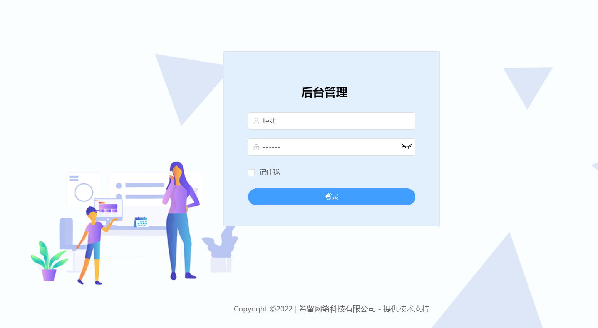

# xiliu-lease-tenant-ui

<p>
  <a href="#公众号"></a>
  <a href="https://github.com/277769738/xiliu-lease-tenant-ui"></a>
  <a href="https://gitee.com/huoqstudy/xiliu-lease-tenant"></a>
</p>

## 前言

这是[xiliu-lease-tenant](https://github.com/277769738/xiliu-lease-tenant)的前端系统。它只包含了 Element UI & axios & iconfont & permission control & lint，这些搭建后台必要的东西。
如果这个项目让你有所收获，记得 Star 关注哦，这对我是非常不错的鼓励与支持。


## 接口项目
请移步[xiliu-lease-tenant](https://github.com/277769738/xiliu-lease-tenant)

## Build Setup

```bash
# 克隆项目
git clone https://github.com/277769738/xiliu-lease-tenant-ui.git

# 进入项目目录
cd xiliu-lease-tenant-ui

# 安装依赖
npm install

# 建议不要直接使用 cnpm 安装以来，会有各种诡异的 bug。可以通过如下操作解决 npm 下载速度慢的问题
npm install --registry=https://registry.npm.taobao.org

# 启动服务
npm run dev
```

浏览器访问 [http://localhost:9528](http://localhost:9528)

## 发布

```bash
# 构建测试环境
npm run build:stage

# 构建生产环境
npm run build:prod
```

## 其它

```bash
# 预览发布环境效果
npm run preview

# 预览发布环境效果 + 静态资源分析
npm run preview -- --report

# 代码格式检查
npm run lint

# 代码格式检查并自动修复
npm run lint -- --fix
```

## 所用技术
### 前端

技术     | 版本 |  说明 |
-------- | ------ | ------
Vue|	2.6|	前端框架
elementUI|	2.15.X|	ui框架
vuex|	3.1.0|	状态管理库
axios|	0.18.1|	网络请求库
avue|	2.10.10|	elementUI增强库

## 开发规约

### 命名规则

Component：
- 所有的Component文件都是以大写开头，除了index.vue。 组件名name 采用首字母大写，避免产生冲突。
例如：@/src/layout/components/Sidebar/index.vue
      @/src/layout/components/Sidebar/Item.vue
      
JS 文件
- 所有的.js文件都遵循横线连接 (kebab-case)

Views
- 在views文件下，代表路由的.vue文件都使用横线连接 (kebab-case)，代表路由的文件夹也是使用同样的规则

使用横线连接 (kebab-case)来命名views主要是出于以下几个考虑。

- 1.横线连接 (kebab-case) 也是官方推荐的命名规范之一
- 2.views下的.vue文件代表的是一个路由，所以它需要和component进行区分(component 都是大写开头)
- 3.页面的url 也都是横线连接的，比如https://www.xxx.admin/export-excel，所以路由对应的view应该要保持统一
- 4.没有大小写敏感问题


## 项目效果



## 内置功能

序号     | 模快 |  说明 |
-------- | ------ | ------
1| 租户管理|配置系统租户，支持 SaaS 场景下的多租户功能。
2|配置租户套餐|自定每个租户的菜单、操作、按钮的权限。
3|用户管理|用户是系统操作者，该功能主要完成系统用户配置。
4|部门管理|配置系统组织机构（公司、部门、小组），树结构展现支持数据权限。
5|菜单管理|配置系统菜单，操作权限，按钮权限标识等。
6|角色管理|角色菜单权限分配、设置角色按机构进行数据范围权限划分。
7|字典管理|对系统中经常使用的一些较为固定的数据进行维护。
8|操作日志|系统正常操作日志记录和查询；系统异常信息日志记录和查询。
9|登录日志|系统登录日志记录查询包含登录异常。
10|在线用户|当前系统中活跃用户状态监控。
11|代码生成|前后端代码的生成（java、html、xml、sql）支持CRUD下载 。
12|系统接口|根据业务代码自动生成相关的api接口文档。
13|服务监控|监视当前系统CPU、内存、磁盘、堆栈等相关信息。
14|缓存监控|监视当前缓存的相关信息。
15|房屋管理|添加、导入房源相关信息。

## 常见问题
* 若发现bug，请提Issues

## 交流群
加微信群交流，公众号后台回复「加群」即可。

| 公众号 | QQ群(577105695) | 
| :------: | :------: |
| | | 

## 结语

欢迎一起探讨，如果你觉得还可以，可以给我点一个star
